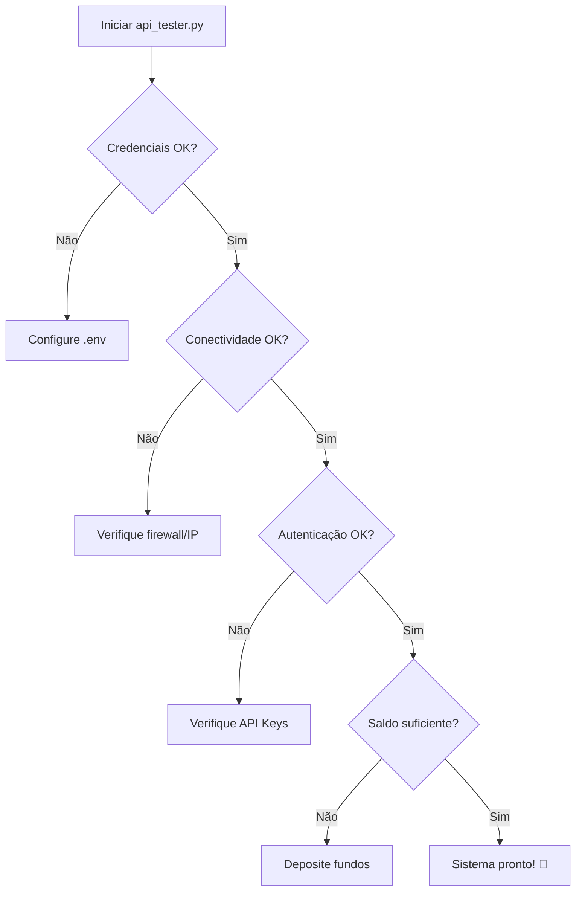

# 🔧 API Tester - Guia de Uso

## O que é o API Tester?

O **api_tester.py** é o "MECÂNICO" do seu robô de trading. Ele verifica se:

- 🔑 **Motor (API)**: As credenciais estão corretas e funcionando
- ⛽ **Combustível (Saldo)**: Há fundos disponíveis para trading
- 🌐 **Conectividade**: O servidor consegue acessar as exchanges
- 🛡️ **Segurança**: O IP está na whitelist (se necessário)

## Quando usar?

Use este script **ANTES** de ligar o robô principal para garantir que tudo está configurado corretamente:

- ✅ Após criar ou atualizar API Keys
- ✅ Ao configurar um novo servidor
- ✅ Quando ordens não aparecem nas exchanges
- ✅ Para diagnosticar problemas de conectividade
- ✅ Antes de iniciar trading em produção

## Como usar?

### Instalação de dependências

```bash
pip install python-dotenv ccxt pybit requests
```

### Uso básico

```bash
# Testa ambas exchanges (Bybit + Binance)
python api_tester.py

# Testa apenas Bybit
python api_tester.py --bybit

# Testa apenas Binance
python api_tester.py --binance

# Testes completos com dados de mercado
python api_tester.py --full
```

## O que o script testa?

### Para Bybit:

1. ✅ **Credenciais**: Valida API Key e Secret
2. ✅ **Conectividade**: Testa conexão com servidor Bybit
3. ✅ **Autenticação**: Verifica permissões da API Key
4. ✅ **Saldo**: Consulta saldo USDT disponível
5. ✅ **Dados de Mercado**: Acessa preços e volume (modo `--full`)
6. ✅ **IP Whitelisting**: Mostra IP público do servidor

### Para Binance:

1. ✅ **Credenciais**: Valida API Key e Secret (opcional)
2. ✅ **Conectividade**: Testa conexão com servidor Binance
3. ✅ **Autenticação**: Verifica se as credenciais funcionam
4. ✅ **Saldo**: Consulta saldo USDT disponível
5. ✅ **Dados de Mercado Públicos**: Acessa ticker BTC/USDT
6. ✅ **Order Book**: Testa acesso ao livro de ofertas (modo `--full`)

## Interpretando os resultados

### ✅ Sucesso (Verde)

```
✅ Autenticação bem-sucedida!
✅ Saldo Total: $1,234.56 USDT
✅ Saldo Disponível: $1,000.00 USDT
```

**Significado**: Tudo está funcionando corretamente! O robô pode operar.

### ⚠️ Avisos (Amarelo)

```
⚠️ Saldo disponível baixo (< $10 USDT)
⚠️ Modo TESTNET ativo - usando contas de teste
```

**Significado**: Sistema funcional, mas há pontos de atenção.

### ❌ Erros (Vermelho)

```
❌ API Key não configurada
❌ Falha na autenticação (retCode: 10003)
❌ Erro ao consultar saldo
```

**Significado**: Há problemas que impedem o funcionamento. Corrija antes de continuar.

## Problemas comuns e soluções

### Erro: "API Key não configurada"

**Causa**: Arquivo `.env` não tem credenciais ou está usando valores de exemplo.

**Solução**:
1. Copie `.env.example` para `.env`
2. Edite `.env` com suas credenciais reais
3. Não use valores que começam com `YOUR_`

### Erro 10003: "Chave de API inválida"

**Causa**:
- API Key incorreta
- 2FA ativo na API Key (não na conta)
- Usando chave de testnet em modo produção (ou vice-versa)

**Solução**:
1. Verifique se copiou a chave corretamente (sem espaços)
2. Na Bybit, desative 2FA na configuração da API Key
3. Confirme se a chave corresponde ao modo (testnet vs produção)

### Erro: "Falha na autenticação"

**Causa**: Credenciais incorretas ou IP bloqueado.

**Solução**:
1. Verifique API Key e Secret no arquivo `.env`
2. Confirme que o IP do servidor está na whitelist da exchange
3. Regenere as chaves se necessário

### Aviso: "Saldo disponível baixo"

**Causa**: Menos de $10 USDT disponível.

**Solução**:
1. Deposite mais fundos na exchange
2. Ajuste o percentual de risco (`RISK_PER_TRADE_PCT`)
3. Feche posições abertas para liberar margem

### Aviso: "Modo TESTNET ativo"

**Causa**: `USE_TESTNET=true` no arquivo `.env`.

**Solução**:
- Se quer operar com dinheiro real: `USE_TESTNET=false`
- Se quer apenas testar: mantenha `USE_TESTNET=true`

## Modo Testnet vs Produção

### Testnet (Testes seguros)

```env
USE_TESTNET=true
```

- ✅ **Seguro**: Não usa dinheiro real
- ✅ **Gratuito**: Fundos virtuais ilimitados
- ❌ **Separado**: Contas testnet são diferentes das reais
- ❌ **Ordens não aparecem**: Não aparece na conta de produção

**Endpoints Testnet**:
- Bybit: `https://api-testnet.bybit.com`
- Binance: `https://testnet.binancefuture.com`

### Produção (Trading real)

```env
USE_TESTNET=false
```

- ⚠️ **Risco real**: Usa dinheiro de verdade
- ✅ **Conta real**: Ordens aparecem na sua conta
- ✅ **Lucros reais**: Ganhos e perdas são reais
- ⚠️ **Cuidado**: Configure SL/TP corretamente

**Endpoints Produção**:
- Bybit: `https://api.bybit.com`
- Binance: `https://fapi.binance.com`

## Configurando IP Whitelisting

### Por que é necessário?

Algumas exchanges (como Bybit) exigem que você adicione o IP do servidor à whitelist para maior segurança.

### Como descobrir o IP?

O script mostra automaticamente:
```
ℹ️  IP público do servidor: 123.45.67.89
```

### Como adicionar à whitelist?

**Bybit:**
1. Acesse: https://www.bybit.com/app/user/api-management
2. Selecione sua API Key
3. Em "IP Restriction", adicione o IP mostrado pelo script
4. Salve as alterações

**Binance:**
1. Acesse: https://www.binance.com/en/my/settings/api-management
2. Clique em "Edit" na sua API Key
3. Em "IP Access Restrictions", adicione o IP
4. Confirme com 2FA

## Fluxo de diagnóstico completo



## Arquivos relacionados

- **api_tester.py**: Este script (o mecânico)
- **diagnostico_config.py**: Verifica variáveis de ambiente
- **diagnostico_execucao_ordens.py**: Diagnostica por que ordens não executam
- **diagnostico_modo_real.py**: Verifica modo testnet vs produção
- **.env**: Arquivo com suas credenciais (nunca compartilhe!)
- **.env.example**: Modelo de configuração

## Exemplo de saída completa

```
╔═══════════════════════════════════════════════════════════════════════════════╗
║                                                                               ║
║                    🔧 API TESTER - BYBIT & BINANCE 🔧                        ║
║                                                                               ║
║              Validador de Conectividade e Autenticação                       ║
║                                                                               ║
╚═══════════════════════════════════════════════════════════════════════════════╝

▶ Configuração do Sistema
────────────────────────────────────────────────────────────────────────────────
   ALLOW_ORDER_EXECUTION: True
   ALLOW_REAL_TRADING: True
   USE_TESTNET: False

==============================================================================
                          🟡 TESTE DA API BYBIT
==============================================================================

✅ Modo PRODUÇÃO ativo - usando contas reais
   Endpoint: https://api.bybit.com

▶ 1. Validação de Credenciais
────────────────────────────────────────────────────────────────────────────────
✅ API Key: abcdefgh12...5678
✅ API Secret: zyxwvuts98...4321

▶ 2. Teste de Conectividade
────────────────────────────────────────────────────────────────────────────────
ℹ️  Inicializando cliente Bybit...
✅ Cliente inicializado com sucesso

▶ 3. Teste de Autenticação
────────────────────────────────────────────────────────────────────────────────
ℹ️  Testando autenticação com API Key...
✅ Autenticação bem-sucedida!
   User ID: 12345678
   Read Only: 0

▶ 4. Teste de Saldo (Combustível)
────────────────────────────────────────────────────────────────────────────────
ℹ️  Consultando saldo USDT...
✅ Saldo obtido com sucesso!
   Saldo Total: $1,234.56 USDT
   Saldo Disponível: $1,000.00 USDT
   Equity: $1,234.56 USDT

▶ Resumo do Teste Bybit
────────────────────────────────────────────────────────────────────────────────
✅ 🎉 TODOS OS TESTES BYBIT PASSARAM!
ℹ️  O motor (API) está funcionando e o combustível (Saldo) está pronto!

================================================================================
                            📊 RESUMO FINAL DOS TESTES
================================================================================

✅ Bybit: PASSOU ✓
✅ Binance: PASSOU ✓

╔═══════════════════════════════════════════════════════════════════════════════╗
║                                                                               ║
║                     🎉 SISTEMA PRONTO PARA OPERAR! 🎉                        ║
║                                                                               ║
║              O motor está ligado e o tanque está cheio!                      ║
║                                                                               ║
╚═══════════════════════════════════════════════════════════════════════════════╝
```

## Próximos passos

Após todos os testes passarem:

1. ✅ **Configure variáveis de ambiente no Railway**:
   ```
   ALLOW_ORDER_EXECUTION=true
   ALLOW_REAL_TRADING=true
   USE_TESTNET=false
   ```

2. ✅ **Inicie o robô**:
   ```bash
   python main_web.py
   ```

3. ✅ **Monitore os logs** para confirmar que ordens estão sendo executadas

4. ✅ **Verifique a interface web** em: http://localhost:5000

5. ✅ **Acompanhe as posições** diretamente na Bybit/Binance

## Suporte

Se encontrar problemas:

1. Execute `python diagnostico_config.py` para verificar configuração
2. Execute `python diagnostico_execucao_ordens.py` para diagnóstico completo
3. Verifique os logs do sistema
4. Consulte a documentação no diretório `/docs`

---

**⚠️ IMPORTANTE**:
- Nunca compartilhe seu arquivo `.env` ou suas API Keys
- Teste SEMPRE em testnet antes de usar em produção
- Configure Stop Loss e Take Profit adequadamente
- Monitore o robô regularmente, especialmente nos primeiros dias
