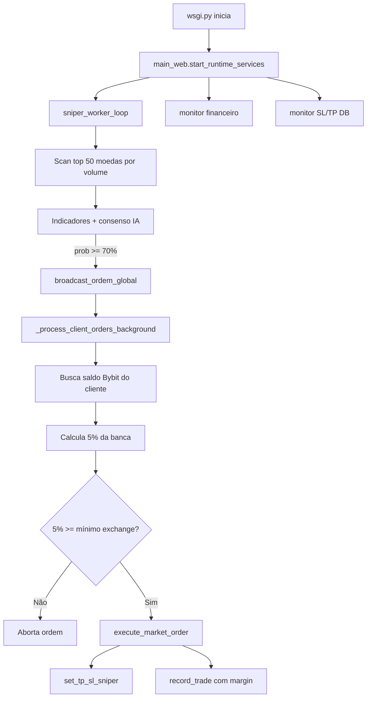

# Documentação Completa — Lógica do Robô AI Sniper Bybit V5

## 1. Visão geral

O **AI Sniper Bybit V5** é um sistema de trading automatizado que:

1. Varre moedas USDT com alto volume na Bybit
2. Calcula indicadores técnicos (SMA, RSI, Fibonacci, SuperTrend, etc.)
3. Valida sinais com consenso de IA (Groq + Gemini + motor local)
4. Executa ordens para clientes cadastrados
5. Monitora posições com Take Profit e Stop Loss proporcionais à margem

**Ponto de entrada em produção:** `wsgi.py` → `main_web.py`

**CLI standalone:** `python main.py [SYMBOL]`

---

## 2. Regra de tamanho da posição (CORRIGIDA)

### Regra principal — 5% da banca (NÃO o mínimo da moeda)

```
margem_usdt = saldo_banca × percentual_entrada
quantidade  = (margem_usdt × alavancagem) / preço_atual
```

| Parâmetro | Valor padrão | Variável de ambiente |
|-----------|--------------|----------------------|
| Entrada padrão | **5%** da banca | `RISK_PER_TRADE_PCT=5` |
| Após STOP_LOSS | **3%** da banca | `ENTRY_AFTER_STOP_PCT=3` |
| Alavancagem (produção) | **20×** | hardcoded `ALAVANCAGEM` em `main_web.py` |
| Alavancagem (CLI) | **10×** | `LEVERAGE` em `main.py` |

### Exemplo prático

- Saldo: **$1.000 USDT**
- Entrada: **5%** → margem = **$50**
- Alavancagem: **20×**
- Preço BTC: **$50.000**
- Quantidade: `(50 × 20) / 50000 = 0.02 BTC`
- Nocional: **$1.000** (50 × 20)

### O que NÃO fazemos mais

O sistema **não** usa mais o valor mínimo de cada moeda na exchange como tamanho da ordem.

Se **5% da banca** for menor que o mínimo exigido pela Bybit para aquele par, a ordem é **abortada** com log explicativo — o robô **não aumenta** a quantidade para o mínimo.

### Arquivos responsáveis

| Arquivo | Função |
|---------|--------|
| `src/risk/position_sizing.py` | Cálculo centralizado (margem, qty, TP/SL) |
| `main_web.py` | `_calculate_dynamic_order_quantity()` |
| `main.py` | `calculate_entry_qty()` |
| `src/broker/bybit_client.py` | `validate_pct_sizing_qty()`, `execute_market_order(strict_pct_sizing=True)` |

---

## 3. Fluxo operacional (produção)



### Ciclo do sniper (`sniper_worker_loop`)

1. Lista as 50 moedas USDT com maior volume 24h
2. Para cada moeda, busca candles de 30 minutos
3. `IndicatorEngine` calcula sinais técnicos
4. `GroqValidator` + IA retornam probabilidade e motivo
5. Se probabilidade ≥ 70% e confluências OK → dispara broadcast
6. Cooldown de 15s entre ciclos

### Execução por cliente (`_process_client_orders_background`)

1. Itera clientes ativos no banco SQLite
2. Modo conservador: bloqueia se já houver posição aberta
3. Calcula margem = 5% do saldo real Bybit (3% se último trade foi STOP_LOSS)
4. Envia ordem market com `strict_pct_sizing=True`
5. Registra trade no banco com `margin`, `quantity`, `entry_price`
6. Configura TP/SL na exchange
7. Notifica via Telegram (se configurado)

---

## 4. Take Profit e Stop Loss

### Regra proporcional à margem

| Alvo | Sobre a margem | Exemplo (margem $50) |
|------|----------------|----------------------|
| Take Profit | **+100%** | fecha em +$50 unrealised PnL |
| Stop Loss | **-50%** | fecha em -$25 unrealised PnL |

### Preços na exchange (`set_tp_sl_sniper`)

Com alavancagem **L**:

```
movimento_tp_preço = 100% / L
movimento_sl_preço =  50% / L
```

Com **20×** (produção):

- **Long TP:** entrada × 1.05 (+5% preço = +100% margem)
- **Long SL:** entrada × 0.975 (-2.5% preço = -50% margem)

Com **10×** (CLI):

- **Long TP:** entrada × 1.10 (+10% preço)
- **Long SL:** entrada × 0.95 (-5% preço)

### Monitores de saída (3 camadas)

1. **Exchange TP/SL** — `set_tp_sl_sniper()` na ordem
2. **Monitor financeiro** — `_monitor_financial_stop_loss()` lê `unrealisedPnl` e usa margem real da posição (do banco ou cálculo nocional/leverage)
3. **Monitor DB** — `_monitor_sl_tp_automatico()` fecha trades no banco em -50% / +100% PnL %

---

## 5. Gestão de risco adicional

| Regra | Valor |
|-------|-------|
| Modo conservador | Máximo **1** posição aberta |
| Modo agressivo | Máximo **5** posições |
| Confiança mínima IA | **70%** (web) / **60%** (CLI) |
| Confluências obrigatórias | **5** (CLI) |
| Após STOP_LOSS | Próxima entrada **3%** (não 5%) |

---

## 6. Variáveis de ambiente

```env
# Tamanho da posição
RISK_PER_TRADE_PCT=5          # % da banca por ordem (padrão 5)
ENTRY_AFTER_STOP_PCT=3        # % após stop loss (padrão 3)

# Execução
USE_TESTNET=true              # testnet vs mainnet
ALLOW_REAL_TRADING=false      # gate de segurança
ALLOW_ORDER_EXECUTION=true    # permite envio de ordens

# Bybit
BYBIT_API_KEY=...
BYBIT_API_SECRET=...

# CLI
SYMBOL=ETHUSDT
SCAN_INTERVAL=30
```

---

## 7. Erros corrigidos nesta revisão

| Problema | Antes | Depois |
|----------|-------|--------|
| Tamanho da ordem (CLI) | Mínimo da moeda | **5% da banca** |
| `_normalize_order_qty` | Aumentava qty para mínimo | Modo strict: **aborta** se 5% < mínimo |
| Monitor financeiro | Alvos fixos $5 / -$2.50 | **Proporcional à margem real** |
| `set_tp_sl_sniper` | SL em -50% do **preço** (errado) | SL em -50% da **margem** (correto) |
| `RISK_PER_TRADE_PCT` | Carregado mas ignorado no CLI | **Aplicado** em todos os caminhos |
| Testes | Esperavam 15% | Alinhados a **5%** |

---

## 8. Estrutura de arquivos

```
ai-sniper-bybit-v5-master-main/
├── wsgi.py                 # Entrada produção (Gunicorn/Railway)
├── main_web.py             # Bot principal + API Flask
├── main.py                 # Bot CLI standalone
├── src/
│   ├── risk/
│   │   └── position_sizing.py   # Cálculo 5% banca (NOVO)
│   ├── broker/
│   │   ├── bybit_client.py      # Ordens Bybit V5
│   │   └── order_calculator.py   # Validação vs mínimo exchange
│   ├── engine/
│   │   └── indicators.py        # Indicadores técnicos
│   ├── ai_brain/
│   │   ├── validator.py           # Consenso Groq/Gemini
│   │   └── learning.py            # Memória neural
│   └── database/
│       └── manager.py             # SQLite clientes/trades
└── docs/
    └── LOGICA_ROBO_COMPLETA.md    # Este documento
```

---

## 9. Fórmulas de referência rápida

```
margem     = saldo × (RISK_PER_TRADE_PCT / 100)
qty        = (margem × alavancagem) / preço
nocional   = qty × preço = margem × alavancagem

tp_pnl     = +margem          (+100% ROI na margem)
sl_pnl     = -margem × 0.5    (-50% ROI na margem)

tp_preço_long  = entrada × (1 + 1/alavancagem)
sl_preço_long  = entrada × (1 - 0.5/alavancagem)
```

---

## 10. Como validar

```bash
# Teste de percentual de risco
python tests/test_risk_per_trade_pct.py

# Teste de fluxo de broadcast
python tests/test_broadcast_real_order_flow.py
```

Verifique nos logs:

```
💰 [CALC QTY] Margem de entrada: $50.00 USDT (5.0% da banca)
🔢 [CALC QTY] Qty calculada (5% banca, não mínimo moeda): 0.020000
🔮 Enviando Ordem Real: Cliente=... | Margem=50.0 | Par=BTC/USDT:USDT
```
